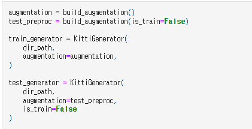
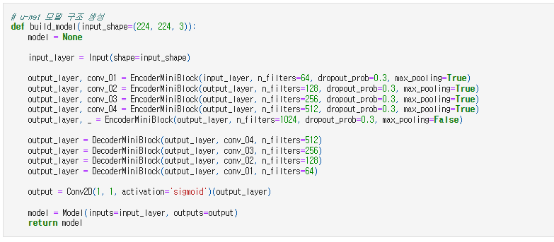
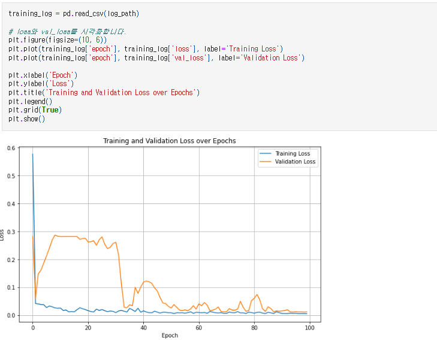
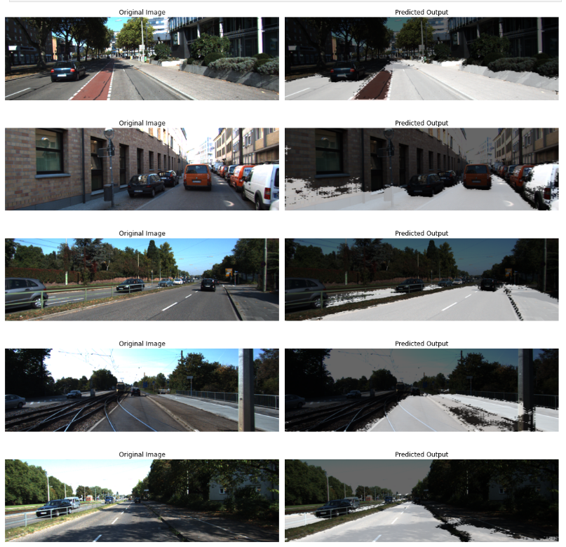
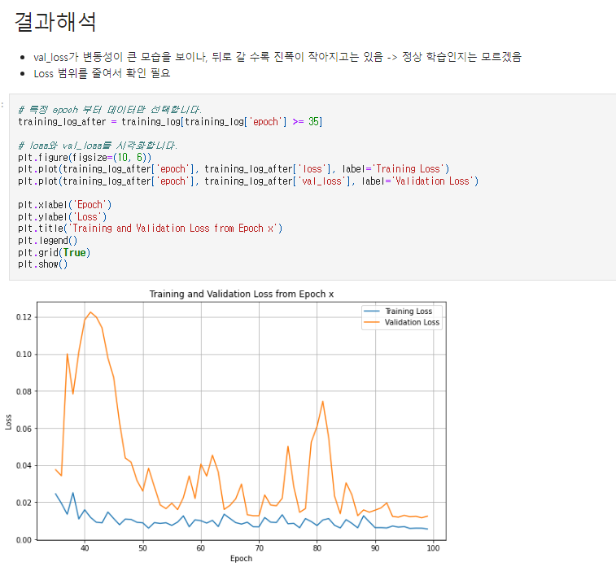
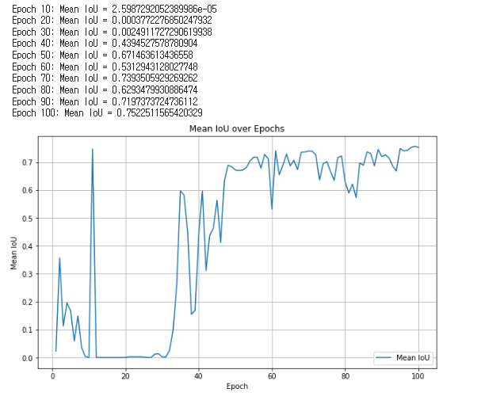
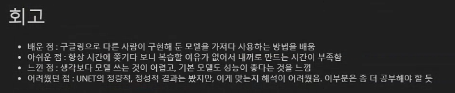

🔑 **PRT(Peer Review Template)**

- 코드 : 이얼
- 리뷰어 : 이현동

- [ ]  **1. 주어진 문제를 해결하는 완성된 코드가 제출되었나요? (완성도)**
    > - 문제에서 요구하는 최종 결과물이 첨부되었는지 확인
    > - 문제를 해결하는 완성된 코드란 프로젝트 루브릭 3개 중 2개, 퀘스트 문제 요구조건 등을 지칭
    >     - 해당 조건을 만족하는 부분의 코드 및 결과물을 캡쳐하여 사진으로 첨부

    - [x] KITTI 데이터셋 구성, U-Net 모델 훈련, 결과물 시각화의 한 사이클이 정상 수행되어 세그멘테이션 결과 이미지를 제출
        - KITTI 데이터셋 구성  
            
        - U-Net 모델 훈련  
            
        - 결과물 시각화  
            
            

    - [ ] U-Net++ 모델을 스스로 구현하여 학습 진행 후 세그멘테이션 결과까지 정상 진행
        - U-Net++ 미구현

    - [ ] U-Net++ 의 세그멘테이션 결과 사진과 IoU 계산치를 U-Net과 비교하여 우월함을 확인
        - U-Net++ 미구현

- [x]  **2. 프로젝트에서 핵심적인 부분에 대한 설명이 주석(닥스트링) 및 마크다운 형태로 잘 기록되어있나요? (설명)**
    > - [ ]  모델 선정 이유
    > - [ ]  Metrics 선정 이유
    > - [ ]  Loss 선정 이유

    - U-Net Loss에 대한 결과 해석  
        

    - 각 epoch 당 IoU Mean 결과  
        

- [ ]  **3. 체크리스트에 해당하는 항목들을 모두 수행하였나요? (문제 해결)**
    > - [ ]  데이터를 분할하여 프로젝트를 진행했나요? (train, validation, test 데이터로 구분)
    > - [ ]  하이퍼파라미터를 변경해가며 여러 시도를 했나요? (learning rate, dropout rate, unit, batch size, epoch 등)
    > - [ ]  각 실험을 시각화하여 비교하였나요?
    > - [ ]  모든 실험 결과가 기록되었나요?

    - U-Net 구현 및 시각화는 잘 수행되었음.
        - 다양한 결과물(loss, epoch당 IoU 등)에 대한 내용 해석 및 시각화가 포인트라고 생각됨.  
            
            
    - U-Net++ 구현 및 시각화는 아직 구현이 되지 않았음.

- [x]  **4. 프로젝트에 대한 회고가 상세히 기록 되어 있나요? (회고, 정리)**
    >   
    - [x]  배운 점
    - [x]  아쉬운 점
    - [x]  느낀 점
    - [x]  어려웠던 점